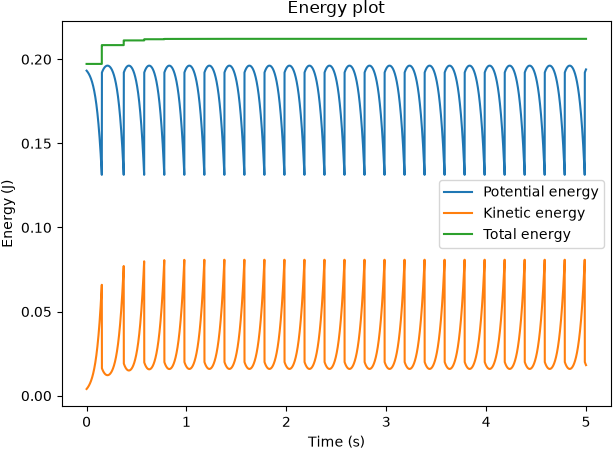
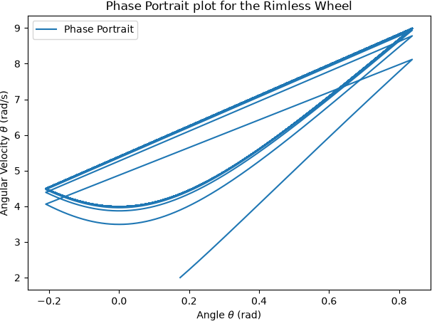
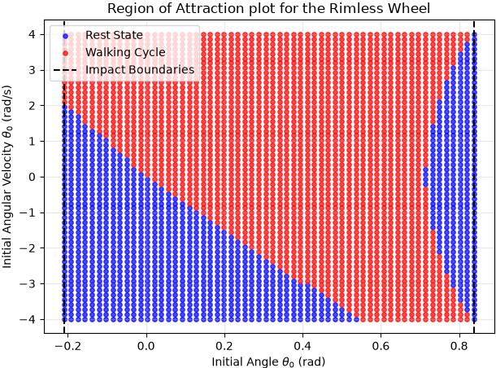
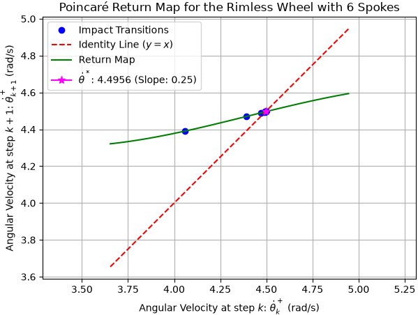
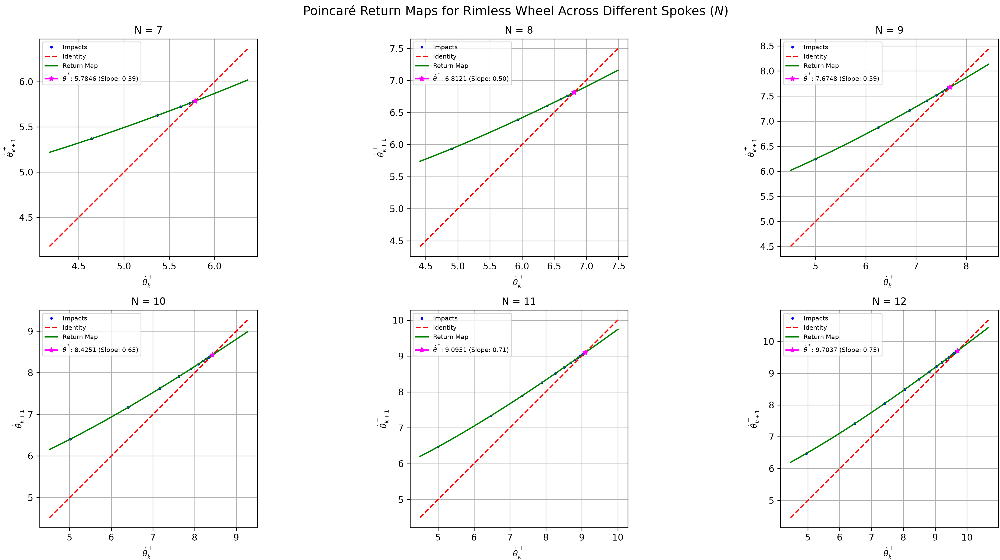
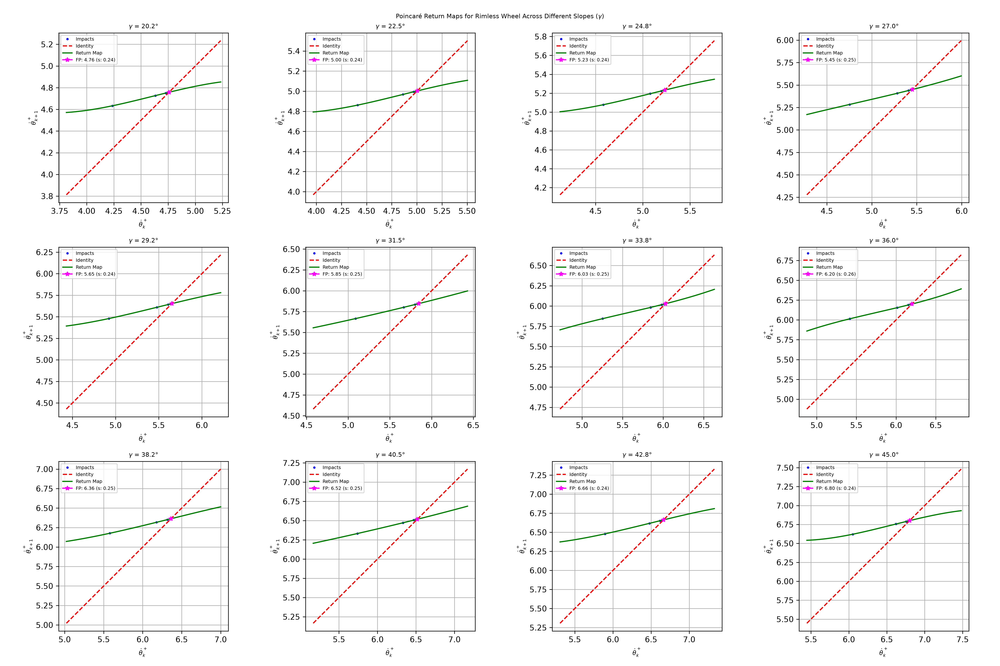
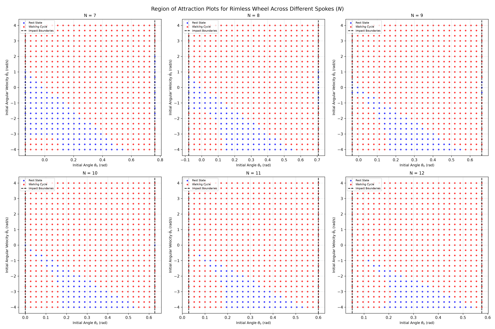
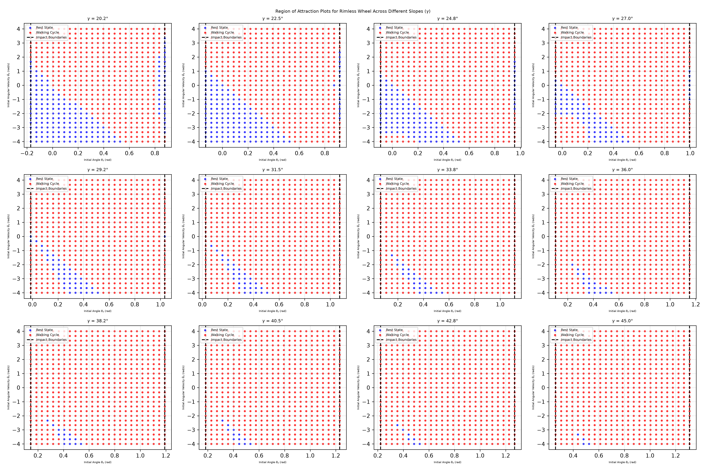

# Assignment 1

`uv run assignment_1.py`

`uv run RoA.py`

`uv run Poincare_Gamma_Sweep.py`

`uv run Poincare_N_Sweep.py`

`uv run RoA_Gamma_Sweep.py`

`uv run RoA_N_Sweep.py`

## Model: the Rimless Wheel
1. An explanation of your sanity checks, including what you expected and what happened. **(5 pts)**

    The first sanity check used to verify the correctness of the model was the energy conservation test. For a positive incline angle, $\gamma > 0$, an initial angular position satisfying $(\gamma - \alpha) < \theta < (\gamma + \alpha)$, and a small initial angular velocity, $\dot{\theta} = 1$, the rimless wheel should roll down the incline. The system's total mechanical energy should remain approximately constant between impacts, while energy is redistributed between kinetic and potential forms At each foot-ground impact, the wheel experiences a sudden reduction in kinetic energy due to the inelastic collision, accompanied by a corresponding increase in potential energy as the wheel transitions to the next support leg. After the system converges to its stable limit cycle, the total energy should exhibit a consistent periodic behavior rather than an unbounded increase or decrease. This behavior is observed in the energy plot below, indicating that the model's energy dynamics are consistent with the expected behavior of the rimless wheel.

    

    The second sanity check was the phase portrait. For a rimless wheel rolling down an incline, the phase portrait should converge to a stable limit cycle. This limit cycle represents the steady, periodic rolling motion of the system, in which continuous pendulum-like motion between impacts is followed by discrete changes in angular velocity when the next leg strikes the ground. As shown in the phase portrait below, the trajectory converges toward a closed, repeating orbit, demonstrating that the model exhibits the expected stable periodic rolling behavior.

    

## Analysis
1. A state-space plot showing the RoA of every stable attractor, including fixed points and limit cycles. **(5 pts)**

    

2. One-dimensional return-map plot, with its fixed point and the identity line clearly marked. **(5 pts)**
    
    

3. Visualization and discussion of how the slope and number of spokes affects the RoA and local convergence **(10 pts)**

    

    As $N$ increases, the wheel becomes "rounder," and the step angle $2\alpha$ shrinks. The post-impact velocity is scaled by $\cos(2\alpha)$, so a smaller step angle means significantly less kinetic energy is dissipated into the ground at each collision. As seen in the above figure, this allows the wheel to maintain drastically higher steady-state rolling velocities ($\dot{\theta}^*$). However, this reduced energy loss also makes the motion slightly less stable. The Floquet multiplier increases from $0.39$ at $N=7$ to $0.75$ at $N=12$, indicating that disturbances take longer to die out. In other words, when less energy is lost at each impact, the wheel takes more steps to settle back into its normal rolling motion after being disturbed.

    

    From the above figure, it is observed that the steady-state velocity ($\dot{\theta}^*$) increases as the slope $\gamma$ becomes steeper. This is as expected based on the dynamics of the rimless wheel. However, the rate at which the system settles back to this steady motion, which is the slope of the Poincare return map, which is the Floquet multiplier ($\lambda$), remains nearly unchanged. This is because most of the damping of small velocity disturbances happens during the impact between the spoke and the ground, which depends mainly on the spoke geometry rather than the slope of the ground. As a result, the rolling motion remains similarly stable across the different ground slopes.

    

    Changing the number of spokes $N$ changes the angle between neighboring spokes, $2\alpha = 2\pi/N$, which affects how much energy is lost when each spoke hits the ground. It also changes the overall shape of the state space. With more spokes packed closely together, each step is much smaller, leading to lower energy loss during collision with the ground reduces. The rimless wheel behaves less like a clunky wooden leg and more like a smooth rolling tire. Because less energy is lost at each collision, it becomes much easier for the wheel to keep its momentum going. Even if the wheel starts with a relatively small initial velocity, it doesn't get trapped in the rest position easily. Increasing $N$ expands the basin of attraction that leads to steady, perpetual walking, making it far more likely to keep rolling downhill rather than coming to a dead stop.

    

    Increasing the ground slope $\gamma$ introduces additional potential energy into the rimless wheel during the continuous swing phase, thereby shifting the overall dynamics toward sustained rolling. As illustrated in the figure above, a steeper incline enlarges the Region of Attraction of the stable limit cycle. Meanwhile, the rest-state basin (blue) progressively shrinks and shifts toward the lower-left region of the state space. This is consistent with the underlying dynamics, as increasing the ground slope $\gamma$ promotes sustained rolling by increasing the gravitational component driving the wheel forward, thereby reducing the tendency of the rimless wheel to remain in a static rest state.

